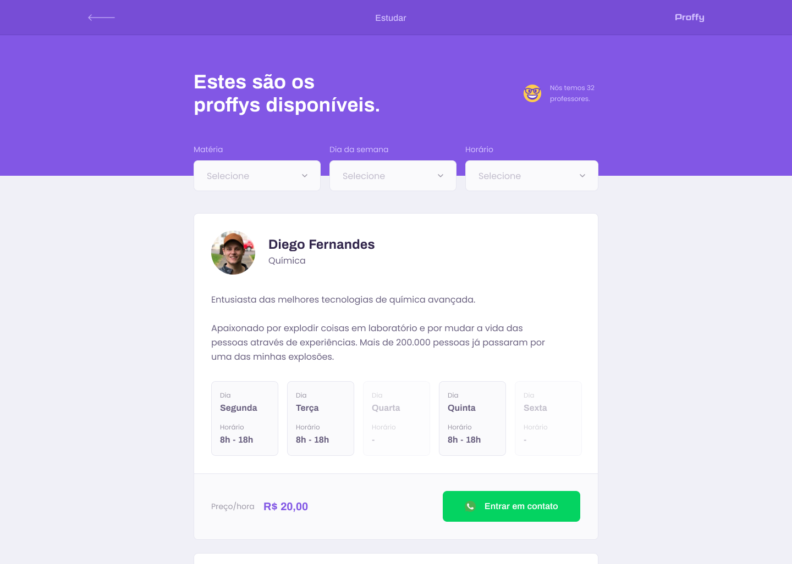

<h1 align="center">
  
</h1>

<h3 align="center">Proffy - A plataforma que conecta estudantes e professores</h3>

<h5 align="center">🚧 Em construção... 🚧</h5>

<p align="center">
  
  
  

  

  

  <a href='https://app.netlify.com/sites/admiring-brattain-93e78f/deploys'>
  </a>

  <br/>

  
</p>

## Sobre
Esse projeto permite o cadastro de professores e alunos. Os professores  informam os horários e as matérias que gostariam de lecionar e os alunos podem buscar e entrar em contato com os professores casdastrados para marcarem aulas particulares.

## Demo
<div align='center'>
  
</div>

## Live
https://admiring-brattain-93e78f.netlify.app/

email: teste@email.com
senha: proffy

## Layouts 

<a href='https://www.figma.com/file/Q7gzokRc3MQ1k1y39SFQPb/Proffy-Web-2.0-Copy?node-id=160%3A2761'>
</a>

<div style="display: flex;
flex-direction:column; justify-content: space-between; align-items: center;">
  

  

</div>

## Tecnologias  

### Desenvolvimento
<ul>
  <li>ReactJS</li>
  <li>Typescript</li>
  <li>Expo</li>
  <li>NodeJS</li>
  <li>React Native</li>
</ul>

### Hospedagem
<ul>
  <li>Heroku</li>
  <li>Netlify</li>
</ul>

## Executando a aplicação :rocket:

#### Pré-requisitos
<ul>
  <li><a href="https://docs.docker.com/engine/install/">Docker</a></li>
  <li><a href="https://docs.docker.com/compose/install/">Docker Componse</a></li>
</ul>

Após clonar o repositório 
```bash
git clone https://github.com/GDSRS/NLW-2.git
cd NLW-2
```
execute a aplicação que desejar.

#### Rodando a aplicação web
```bash
docker-compose run web
yarn start
```

#### Rodando a aplicação server
```bash
docker-compose run server
yarn start
```

#### Rodando a aplicação mobile
```bash
docker-compose run mobile
yarn start
```